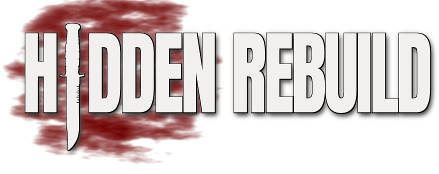

<p align="center">
  <a href="https://www.hidden-rebuild.com/"></a>
</p>

<p align="center">
  <b><a href="https://www.hidden-rebuild.com/">www.hidden-rebuild.com</a></b>
  · <a href="https://www.hidden-rebuild.com/install/">Install</a>
  · <a href="https://www.hidden-rebuild.com/servers/">Servers</a>
  · <a href="https://www.hidden-rebuild.com/plugins/">Plugins</a>
  · <a href="../../releases/latest">Latest release</a>
</p>

# Hidden: Rebuild

[Hidden: Source](http://www.hidden-source.com) (Calibre Studios, Beta 4b, 2006), rebuilt on the
current Source SDK 2013 Multiplayer with the original mod's content: the same game, on a maintained
engine, with 64-bit Windows and Linux builds, native Linux dedicated servers, bots, and the popular
server plugins built in.

The original game code was lost, so this is a full rebuild of the game code on the modern SDK. This
repository is a fork of [ValveSoftware/source-sdk-2013](https://github.com/ValveSoftware/source-sdk-2013)
with a `HIDDEN` game target built on the HL2MP code base. Valve's original README is in
[README.sdk.md](README.sdk.md).

## Playing

Get the **[Hidden: Rebuild Launcher](https://github.com/phit/hidden-2013-launcher/releases/latest)**
([Windows](https://github.com/phit/hidden-2013-launcher/releases/latest/download/HiddenLauncher.exe),
[Linux](https://github.com/phit/hidden-2013-launcher/releases/latest/download/HiddenLauncher-linux)).
It installs the game and keeps it updated, sets up Hidden: Source Beta 4b (whose maps, models and
sounds the game uses) and Source SDK Base 2013 Multiplayer, and starts the game ready for
VAC-secured servers.

The [install page](https://www.hidden-rebuild.com/install/) covers the launcher and installing by
hand from the [releases](../../releases). The [blog](https://www.hidden-rebuild.com/) has what's new
in each release.

## Running a server

Each release has server packages for Source SDK Base 2013 Dedicated Server (SteamCMD app 244310) on
Windows and Linux, and there's an egg for Pterodactyl panels. The
[servers page](https://www.hidden-rebuild.com/servers/) explains installing, updating and
configuring, and lists every cvar; the [plugins page](https://www.hidden-rebuild.com/plugins/)
lists the built-in plugins.

## Layout

| Path | What |
|---|---|
| `src/game/client/client_hidden.vpc`, `src/game/server/server_hidden.vpc` | Client and server projects (HL2MP plus `HIDDEN` define) |
| `src/game/{client,server,shared}/hidden/` | Hidden game code |
| `game/hidden2013/` | The mod folder the game runs from |
| `src/srcds_hidden/` | The 64-bit dedicated server launchers |
| `web/` | The project site (GitHub Pages) |
| `branding/` | Logo, banner and icons, and the script that builds them |
| `tools/` | Build, packaging and asset scripts |
| `.github/workflows/build.yml` | CI: Windows and Linux builds, packages, releases |

## Building

The Beta 4b content isn't in this repository. The mod mounts `game/hidden` (next to
`game/hidden2013`, as in `sourcemods`), so link that to your Beta 4b install:

```powershell
New-Item -ItemType Junction -Path game\hidden -Target "<Steam>\steamapps\sourcemods\hidden"
```

Or copy the content into `game/hidden2013/legacy/`, which is mounted first:
`py tools/import_legacy.py <source> [<source> ...] --clean`, where `<source>` is an installed mod
folder, the `ianua-base-hsb4b.tar.gz` archive, or a zip of maps (`ghs-patch-assets-v2.zip`,
`ghs-mappack-v1.zip`). Only content folders are copied, never the 2006 binaries.

**Windows:** Source SDK 2013 Multiplayer installed through Steam, Visual Studio 2022 (or its Build
Tools) with MSVC v143 and a Windows 10/11 SDK, and Python 3.13+.

```powershell
tools\build.ps1            # Release; add -Regen after changing .vpc files, -Configuration Debug for debug
```

This writes the DLLs to `game/hidden2013/bin/x64`, the shaders to `game/hidden2013/shaders/fxc` and
the launcher to `game/hidden2013_win64.exe`. Run the launcher with Steam running.

**Linux:** [podman](https://podman.io/) and the Steam Runtime's sniper SDK image, which the script
pulls:

```sh
src/buildhidden [release|debug]
```

This writes the libraries to `game/hidden2013/bin/linux64`. The shaders are compiled on Windows only.

**Packages:** `py tools/package.py windows|linux` puts the release archives in `dist/`, from what
the builds left in `game/hidden2013`.

## License

The code is under Valve's [SOURCE 1 SDK LICENSE](LICENSE). Hidden: Source content belongs to Calibre
Studios and is not distributed here.
