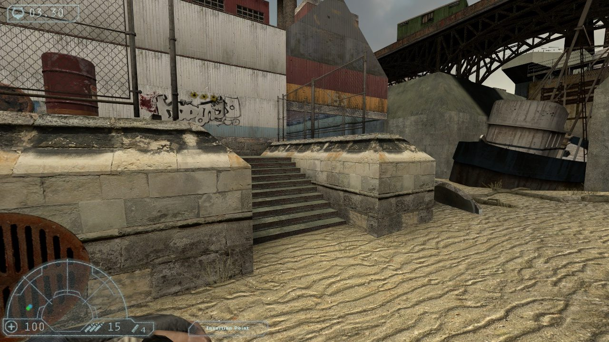
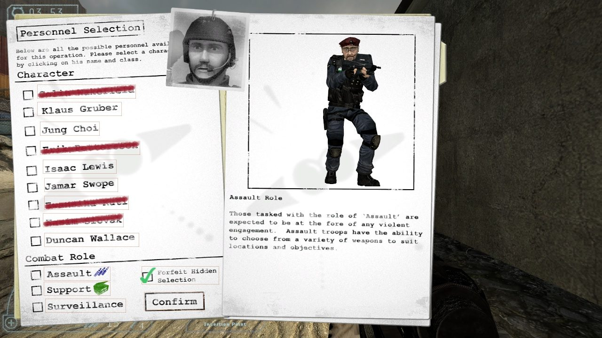

title: Home

# Hidden: Rebuild

Hidden: Rebuild brings [Hidden: Source](https://www.hidden-source.com) back to life on the current
Source SDK 2013 Multiplayer. One player is the Hidden, fast, strong and all but invisible, with only a
knife and pipe bombs. Everyone else is IRIS, a special forces team with guns, sonic alarms and a
thermal radar, who have to find and kill it before it picks them off one by one.

The original game's code was lost. This is a rebuild of Hidden: Source Beta 4b (2006) that plays it
the way it was, with the original maps, models and sounds from your own Beta 4b install, on a
maintained engine with 64-bit Windows and Linux builds and native Linux dedicated servers.

* [Install Hidden: Rebuild](install/)
* [Run a server](servers/) and [the plugins it has built in](plugins/)
* [Source code on GitHub](https://github.com/phit/hidden-2013)

## Downloads

<!-- LATEST_RELEASE -->

## Blog

<!-- BLOG_LIST -->
